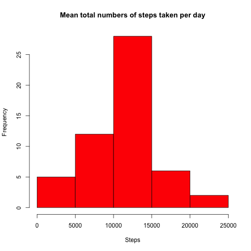
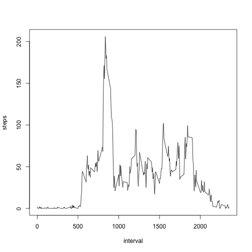
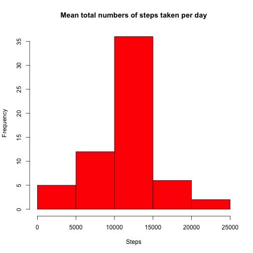
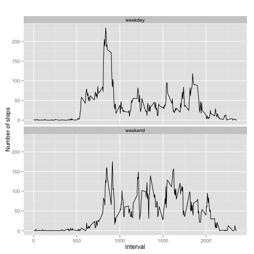

Reproducible Research: Peer Assessment 1
========================================================

## Loading and preprocessing the data


```r
setwd("~/Documents/R/RepData")
activity <- read.csv("~/Documents/R/RepData/activity.csv")
```


## What is  mean total numbers of steps taken per day


```r
total_steps<-aggregate(steps~date, data=activity, sum, na.rm="TRUE") #calculate total steps
hist(total_steps$steps, xlab = "Steps", col = "Red", main = "Mean total numbers of steps taken per day") # plot
```

 

```r
steps_mean<-mean(total_steps$steps) #calculate mean
steps_median<-median(total_steps$steps)  # calculate median
steps_mean
```

```
## [1] 10766
```

```r
steps_median
```

```
## [1] 10765
```

## What is the average daily activity pattern?

```r
interval_steps<-aggregate(steps~interval, data=activity, mean, na.rm="TRUE") #calculate interval steps
plot(steps~interval, data=interval_steps, type="l") #plot
```

 

```r
max(interval_steps$steps) #calculate max interval steps
```

```
## [1] 206.2
```

## Imputing missing values


```r
colSums(is.na(activity))  #calculate na values
```

```
##    steps     date interval 
##     2304        0        0
```

```r
new_value<-mean(activity$steps, na.rm="TRUE") #find mean value 
activity_new<-activity  #create a new dataset based on activity df
activity_new$steps[is.na(activity_new$steps)] <- new_value #replace na values with mean value
colSums(is.na(activity_new)) #calculate na values
```

```
##    steps     date interval 
##        0        0        0
```

```r
total_steps1<-aggregate(steps~date, data=activity_new, sum, na.rm="TRUE") #calculate total steps without na values
hist(total_steps1$steps, xlab = "Steps", col = "Red", main = "Mean total numbers of steps taken per day") #plot
```

 

```r
steps_mean1<-mean(total_steps1$steps) #calculate mean without na values
steps_median1<-median(total_steps1$steps) #calculate median without na values
steps_mean1 
```

```
## [1] 10766
```

```r
steps_median1
```

```
## [1] 10766
```

```r
steps_mean   #na values included
```

```
## [1] 10766
```

```r
steps_median #na values included
```

```
## [1] 10765
```


## Are there differences in activity patterns between weekdays and weekends ?


```r
activity$date <- as.Date(activity$date, "%Y-%m-%d") #convert date column


activity$day <- weekdays(activity$date)  #day of the week


activity$day_type <- c("weekday") # add a new column day_type


for (i in 1:nrow(activity)){     # Mark date_type as weekend
  if (activity$day[i] == "Saturday" || activity$day[i] == "Sunday"){
    activity$day_type[i] <- "weekend"
  }
}


activity$day_type <- as.factor(activity$day_type) # convert day_time to factor


table_interval_steps_imputed <- aggregate(steps ~ interval+day_type, activity, mean) # calculate average number of steps in an interval 


library(ggplot2)  
qplot(interval, steps, data=table_interval_steps_imputed, geom=c("line"), xlab="Interval", 
      ylab="Number of steps", main="") + facet_wrap(~ day_type, ncol=1) #plot 
```

 


